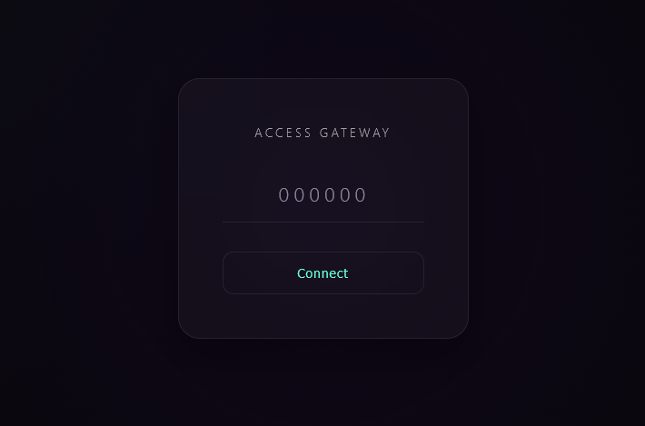

# TOTP Gateway

[](https://github.com/your-username/totp-gateway/actions/workflows/ci.yml)
[](https://crates.io/crates/totp-gateway)
[](https://docs.rs/totp-gateway)
[](LICENSE)
[](https://www.rust-lang.org)
[](https://github.com/cloudflare/pingora)

**TOTP Gateway** is a lightweight, high-performance reverse proxy authentication gateway built on Cloudflare's [Pingora](https://github.com/cloudflare/pingora) framework.

It adds a **Two-Factor Authentication (TOTP)** layer in front of your internal admin panels, private tools, or sensitive API endpoints, effectively blocking unauthorized access. You can enhance security with just a single binary and a configuration file, without setting up complex authentication infrastructure.

## ✨ Key Features

*   **🔒 TOTP-based 2FA Enforcement**: Compatible with standard apps like Google Authenticator and Authy.
*   **🚀 High Performance**: Built on Pingora's asynchronous architecture for speed and stability.
*   **🛡️ Robust Security Policies**:
    *   IP Blacklisting & Automatic Blocking (Brute-force protection).
    *   Configurable login attempts and ban duration.
    *   Session expiration control.
*   **🌐 Flexible Routing**: Supports Glob pattern matching for Hostnames (Subdomains) and Paths.
*   **🔐 SSL/HTTPS Support**: Easily enable TLS via configuration.
*   **🔄 Hot Reload**: Apply configuration changes (`config.toml`) instantly without downtime.
*   **🎨 Custom Login Page**: Fully customizable HTML login interface.



## 📦 Installation

### Option 1: Install from crates.io (Recommended)

```bash
cargo install totp-gateway
```

### Option 2: Build from Source

#### Prerequisites
*   Rust Toolchain (1.85 or later recommended)

```bash
git clone https://github.com/your-username/totp-gateway.git
cd totp-gateway
cargo build --release
```

The compiled binary will be located at `target/release/totp-gateway` (or `totp-gateway.exe` on Windows).

## 🚀 Quick Start

1.  **Generate Config**: Run the binary. If no config exists, it will automatically create `config.toml` from the default template.

    ```bash
    ./target/release/totp-gateway
    ```

2.  **Edit Config**: Open `config.toml` and configure `bind_addr` and `totp_secret` to match your environment.

3.  **Run**:

    ```bash
    ./target/release/totp-gateway --config config.toml
    ```

## ⚙️ Configuration Guide

The `config.toml` file consists of the following sections:

### 1. Server Settings (`[server]`)

```toml
[server]
bind_addr = "0.0.0.0:25000"        # Listening address and port
default_upstream = "127.0.0.1:8080" # Default upstream server if no route matches

# Trusted proxy configuration for real IP extraction
# Essential when running behind Cloudflare Tunnel, Nginx, etc.
trusted_proxies = [
    ["127.0.0.1/32", "CF-Connecting-IP"], 
    ["10.0.0.0/8", "X-Forwarded-For"]
]
```

### 2. Authentication & Session (`[auth]`)

```toml
[auth]
# TOTP Secret (Base32 encoded). Register this key in your Authenticator app.
totp_secret = "JBSWY3DPEHPK3PXP" 
# Load from file: totp_secret_file = "./secret.txt"
# Load from env: totp_secret_env = "MY_TOTP_SECRET"

# Path to custom login HTML file (optional)
login_page_file = "./login_page.html"

# Session duration in seconds. Default: 1800 (30 mins)
session_duration = 3600 
```

### 3. Security Policy (`[security]`)

Core settings to defend against Brute-force attacks.

```toml
[security]
enabled = true                  # Enable security features

max_retries = 5                 # Max failed attempts before banning
ban_duration = 3600             # IP ban duration (seconds)
ip_limit_duration = 3600        # Time window for tracking failures (seconds)

blacklist_size = 1000           # Max IPs in blacklist
blacklist_strategy = "overwrite" # "overwrite" (remove oldest) or "block" (reject new)
```

### 4. HTTPS/TLS (`[tls]`)

If this section is present, the server runs in HTTPS mode.

```toml
[tls]
cert_file = "./certs/fullchain.pem" # Path to certificate
key_file = "./certs/privkey.pem"    # Path to private key
```

### 5. Routing Rules (`[[routes]]`)

Define multiple routes. Matched in order from top to bottom.

```toml
# 1. Route specific path to a different port
[[routes]]
path_prefix = "/admin"
upstream_addr = "127.0.0.1:9090"

# 2. Subdomain matching
[[routes]]
host = "api.example.com"
upstream_addr = "127.0.0.1:3000"

# 3. Wildcard support
[[routes]]
host = "*.internal.com"
path = "/legacy/*"
upstream_addr = "127.0.0.1:4000"
```

## 🛡️ How It Works

1.  User requests a resource via **TOTP Gateway**.
2.  Gateway checks for a valid Session Cookie (`SID`).
3.  **No Session**:
    *   User is redirected to the Login Page.
    *   User enters the TOTP code.
    *   **Success**: A session cookie is issued, and the request is proxied to the upstream server.
    *   **Failure**: Failure count increments. If it exceeds the limit, the IP is **Banned** temporarily.
4.  **Valid Session**: Request is immediately proxied to the upstream server.

## 📊 Performance

Built on Cloudflare's Pingora framework, TOTP Gateway delivers:
- **Low Latency**: Sub-millisecond proxy overhead
- **High Throughput**: Handles thousands of concurrent connections
- **Memory Efficient**: Minimal resource footprint
- **Production Ready**: Battle-tested async runtime

## 🧪 Testing

Run the full test suite:

```bash
# Run all tests
cargo test

# Run with verbose output
cargo test -- --nocapture

# Run specific test
cargo test test_basic_auth_and_replay_protection
```

The test suite includes:
- Unit tests for core components
- Integration tests with mock upstream servers
- Security feature tests (rate limiting, IP banning)
- Session management tests
- Concurrent request handling tests

## 🤝 Contributing

Bug reports, feature suggestions, and Pull Requests are welcome!

1.  Fork the repository.
2.  Create your Feature Branch (`git checkout -b feature/AmazingFeature`).
3.  Commit your changes (`git commit -m 'Add some AmazingFeature'`).
4.  Push to the Branch (`git push origin feature/AmazingFeature`).
5.  Open a Pull Request.

## 📝 License

Distributed under the [MIT License](LICENSE).
